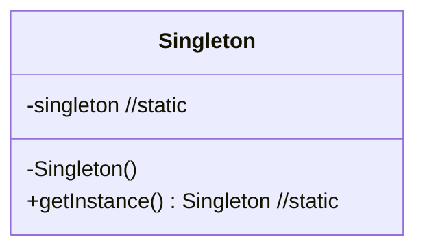

### 싱글톤 패턴  
: 인스턴스가 단 하나만 존재하는 것을 보증하는 패턴

```
프로그래머가 클래스의 생성자를 한 번만 호출하도록 구현할 수 있지만,
클래스의 인스턴스가 반드시 1개만 존재한다는 것을 보증하고 싶을 때 혹은 그것을 프로그램 상에 나타내고 싶을 때 싱글톤 패턴을 활용
```

<br>
<br>
<br>

**class diagram**

*여기서 singleton 필드와 getInstance()메소드는 static이다.  
```
- 클래스 외부에서 생성자 호출을 방지하기 위해 생성자를 private로 선언

new Singleton(); 과 같은 코드가 클래스 외부에 있을 때 컴파일 시 에러가 발생함.

- 인스턴스를 얻기 위해 getInstance()메소드를 public으로 구현
```

<br>
<br>
<br>

**code**
```java
public class Singleton{
  private static Singleton singleton = new Singleton();

  private Singleton(){}

  public Singleton getInstance(){
    return singleton;
  }
}
```


